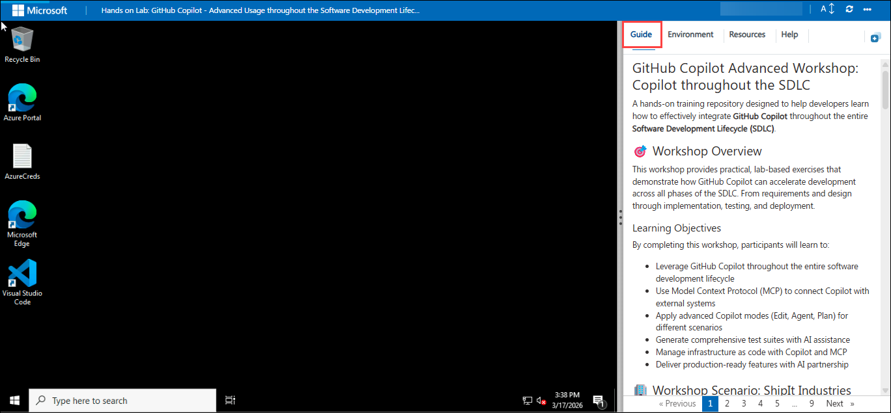
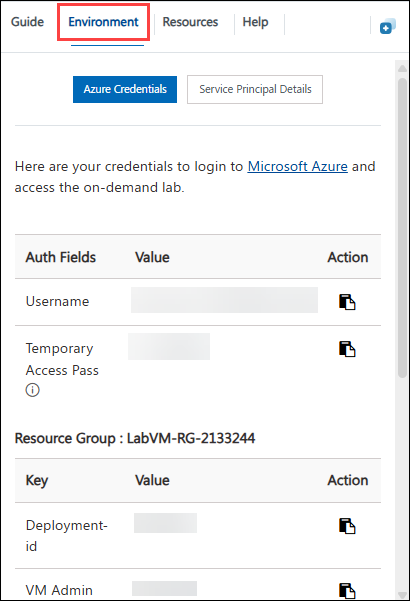
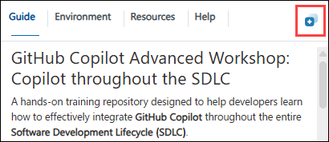
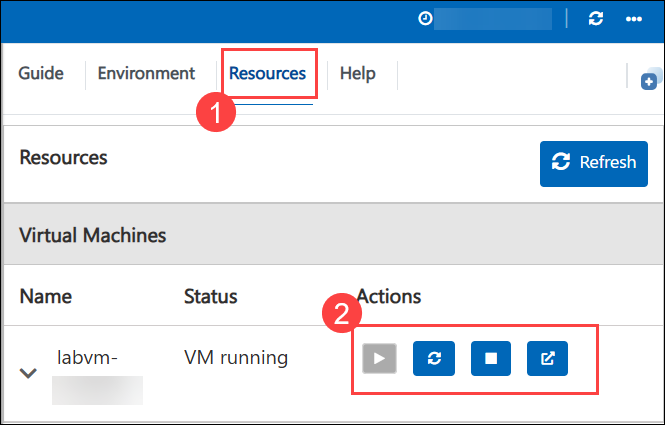
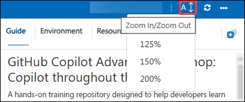

# GitHub Copilot Advanced Workshop: Copilot throughout the SDLC

A hands-on training repository designed to help developers learn how to effectively integrate **GitHub Copilot** throughout the entire **Software Development Lifecycle (SDLC)**.

## 🎯 Workshop Overview

This workshop provides practical, lab-based exercises that demonstrate how GitHub Copilot can accelerate development across all phases of the SDLC. From requirements and design through implementation, testing, and deployment.

### Learning Objectives

By completing this workshop, participants will learn to:

- Leverage GitHub Copilot throughout the entire software development lifecycle
- Use Model Context Protocol (MCP) to connect Copilot with external systems
- Apply advanced Copilot modes (Edit, Agent, Plan) for different scenarios
- Generate comprehensive test suites with AI assistance
- Manage infrastructure as code with Copilot and MCP
- Deliver production-ready features with AI partnership

## 🏢 Workshop Scenario: ShipIt Industries

Throughout this workshop, you'll be working in a real-world scenario:

> **The Situation at ShipIt Industries**
>
> Due to rapid internal growth, ShipIt Industries has found it increasingly difficult to manage their various CI/CD processes. Deployments and jobs are scattered across multiple environments, GitHub Actions, Azure deployments, Azure Functions, and more with no single place to view or control them.
>
> To solve this, management has greenlit the development of an internal application called **ApproveThis**. This tool will centralize job and deployment management into a single, unified interface. Key requirements include:
> - **Visibility**: View all jobs and deployments from one location
> - **Control**: Trigger and manage workflows across different platforms
> - **Approvals**: Require approvals before critical deployments execute
> - **RBAC**: Role-based access control for safe, seamless use across teams
>
> **Your Role**: The initial version of ApproveThis was built by another developer who has since left the company. Management has assigned you to take over the application and implement the remaining functionality. You'll use GitHub Copilot throughout the entire software development lifecycle to complete this mission.
>
> Let's help ShipIt Industries ship it—safely and with approval! 🚀

## 🛠️ The Learning Application: ApproveThis

The workshop centers around building out **ApproveThis**, a job/workflow/process scheduling and approval tool built with **Python** and **Flask**.

### Application Overview

ApproveThis is designed as an internal workflow dispatch and approval system for managing GitHub Actions workflows, as well as other CI/CD systems and deployment environments (Azure, Terraform, etc.). Throughout the labs, participants will progressively build out the application's functionality using GitHub Copilot.

**Key Technologies:**
- **Python 3.8+** - Core programming language
- **Flask** - Web application framework
- **SQLAlchemy** - Database ORM
- **Flask-Login** - Authentication
- **Jinja2** - Templating engine

**Application Features (to be built):**
- User authentication and role-based access control (RBAC)
- Repository browsing and management
- Workflow listing and execution
- Workflow run tracking and monitoring
- Approval workflows for workflow dispatches
- RESTful API endpoints

### Architecture Highlights

The application follows modern Flask best practices:
- **Application Factory Pattern** for flexible configuration
- **Blueprint-based Organization** for modular code structure
- **Provider Pattern** for API abstraction (mock/real GitHub integration)
- **Role-Based Access Control** with granular permissions

## 📁 Repository Structure

```
├── approvethis/          # Main Flask application
│   ├── app/              # Application package
│   │   ├── blueprints/   # Route modules (auth, main, api, jobs)
│   │   ├── models/       # Database models
│   │   ├── providers/    # GitHub API abstraction
│   │   ├── templates/    # Jinja2 HTML templates
│   │   └── static/       # CSS and JavaScript
│   ├── migrations/       # Database migrations
│   ├── terraform/        # Infrastructure as Code
│   ├── tests/            # Test suites (unit, integration, E2E)
│   └── requirements.txt  # Python dependencies
├── docs/                 # Documentation and reference guides
│   ├── MCP-Configuration-Guide.md
│   ├── Azure-DevOps-MCP-Guide.md
│   ├── Terraform-MCP-Guide.md
│   ├── Playwright-Testing-Guide.md
│   ├── Glossary.md
│   └── agents/           # Copilot agent configurations
├── labs/                 # Workshop lab exercises
│   ├── Lab-1-Setup-and-Configuration.md
│   ├── Lab-2-Your-Assignment.md
│   ├── Lab-3-Planning-with-MCP.md
│   ├── Lab-4-Development-Process.md
│   ├── Lab-5-Testing-with-Copilot.md
│   ├── Lab-6-IaC-and-Deployments.md
│   ├── Lab-7-CI-CD-Beyond-GitHub-Actions.md
│   └── Lab-8-Capstone-Approvals.md
└── README.md             # This file
```

## Logging into the Lab Environment

### Accessing Your Lab Environment
 
Once you're ready to dive in, your virtual machine and **Guide** will be right at your fingertips within your web browser.
   
   

### Virtual Machine & Lab Guide
 
Your virtual machine is your workhorse throughout the workshop. The lab guide is your roadmap to success.

### Exploring Your Lab Resources

To get a better understanding of your lab resources and credentials, navigate to the **Environment** tab.



### Utilizing the Split Window Feature

For convenience, you can open the lab guide in a separate window by selecting the **Split Window** button from the top right corner.



### Managing Your Virtual Machine

Feel free to **Start, Stop, or Restart (2)** your virtual machine as needed from the **Resources (1)** tab. Your experience is in your hands!



### Utilizing the Zoom In/Out Feature

To adjust the zoom level for the environment page, click the **A↕: 100%** icon located next to the timer in the lab environment.



## Support Contact

The CloudLabs support team is available 24/7, 365 days a year, via email and live chat to ensure seamless assistance at any time. We offer dedicated support channels tailored specifically for both learners and instructors, ensuring that all your needs are promptly and efficiently addressed.

Learner Support Contacts:

- Email Support: cloudlabs-support@spektrasystems.com
- Live Chat Support: https://cloudlabs.ai/labs-support

### Let’s begin the hands-on lab exercises.

