# Exercise 1 - Setup and Configuration

**Duration**: 20 minutes

## 🎯 Learning Objectives

By the end of this lab, you will be able to:
- Set up the workshop development environment
- Clone and configure your pre-provisioned training repository
- Configure and run the ApproveThis application locally
- Verify GitHub Copilot installation and configuration
- Understand the workshop scenario and learning path

## 🏢 Scenario: Welcome to ShipIt Industries

Welcome to your first day at **ShipIt Industries**! 🏢

Due to rapid internal growth, ShipIt Industries has found it increasingly difficult to manage their various CI/CD processes. Deployments and jobs are scattered across multiple environments, GitHub Actions, Azure deployments, Azure Functions, and more with no single place to view or control them.

To solve this, management has greenlit the development of an internal application called **ApproveThis**. This tool will centralize job and deployment management into a single, unified interface. Key requirements include:

- **Visibility**: View all jobs and deployments from one location
- **Control**: Trigger and manage workflows across different platforms
- **Approvals**: Require approvals before critical deployments execute
- **RBAC**: Role-based access control for safe, seamless use across teams
- **Audit Trail**: Track who executed what, when, and why

**Your Role**: The initial version of ApproveThis was built by another developer who has since left the company. Management has assigned you to take over the application and implement the remaining functionality. You'll use GitHub Copilot throughout the entire software development lifecycle to complete this mission.

> [!IMPORTANT]
> This workshop focuses on **advanced GitHub Copilot scenarios** throughout the SDLC. Unlike fundamentals workshops, you'll explore:
> - Real-world planning with Model Context Protocol (MCP)
> - Advanced development workflows (Edit mode, Agent mode, multitasking)
> - AI-assisted testing with Playwright
> - Infrastructure as Code (IaC) with Terraform
> - CI/CD beyond GitHub Actions
> - Capstone challenge: building a complete feature end-to-end

---

## Step 1: Repository Setup

Your training repository has been **pre-created and pre-configured** for this workshop.

1. In the **Lab VM**, open the **Microsoft Edge** browser from the desktop.

   

1. In a new tab, navigate to the **GitHub login** page by copying and pasting the following URL into the address bar:

   ```
   https://github.com/login
   ```

1. On the **Sign in to GitHub** tab, enter the provided **GitHub username** in the input field, and click on **Sign in with your identity provider** **(2)**.

    - Email/Username: <inject key="GitHub User Name" enableCopy="true"/> **(1)**

      

1. Click on **Continue** on the **Single sign-on to CloudLabs Organizations** page to proceed.

    

1. You'll see the **Sign in** tab. Here, enter your Azure Entra credentials and click **Next (2)**.

   - **Email/Username:** <inject key="AzureAdUserEmail"></inject> **(1)**

       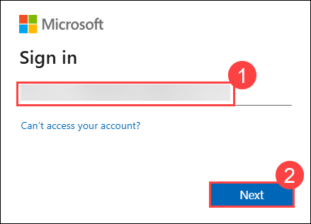

1. Next, provide your Temporary Password and click on **Sign in (2)**

   - **Temporary Access Pass:** <inject key="AzureAdUserPassword"></inject> **(1)**

      

1. On the **Stay Signed in?** pop-up, click on No.

    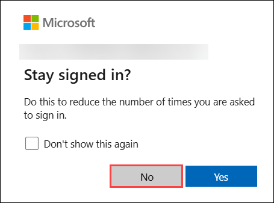

1. You are now successfully logged in to **GitHub** and have been redirected to the **GitHub homepage**.

1. Now navigate to the **approve-this-<inject key="Deployment-id"></inject>** repository which is newly created.

   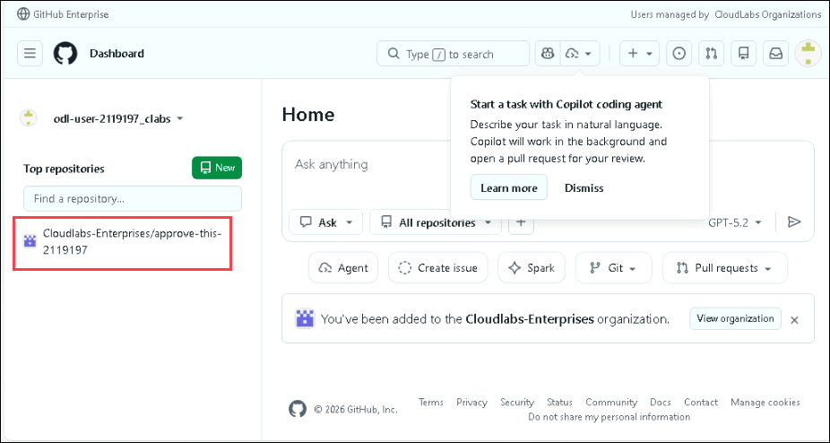

1. In a new PowerShell window, run the below commands to clone the parent repository in your newly created repoistory.

   ```
   git clone https://github.com/CloudLabsAI-Azure/GitHub-Copilot-SDLC-V2.git
   cd GitHub-Copilot-SDLC-V2
   git remote remove origin
   git remote add origin https://github.com/Cloudlabs-Enterprises/approve-this-<inject key="Deployment-id"></inject>
   git push -u origin main --force
   ```

1. On the **GitHub Sign In** pop-up, click **Sign in with your browser**.

   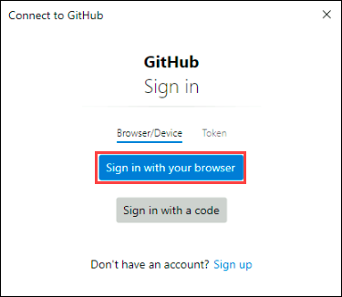

1. On the **Authorize Git Crdential Manager**, click **Authorize git-ecosystem**.

   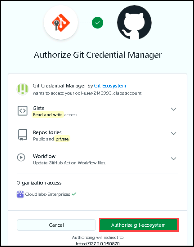

1. You will now see the repository setup is done.

## Step 2: ApproveThis Application Setup

Now let's get the ApproveThis application running locally.

### 2.1 Navigate to Application Directory

1. Open the **Visual Studio Code** shortcut from the desktop of your **Lab VM**.

   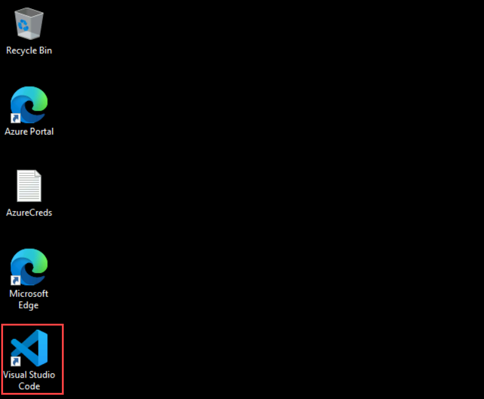

1. In the **File** option, click on **Open Folder**.

   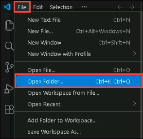

1. Select the **GitHub-Copilot-SDLC-V2** foler and click **Select folder**.

   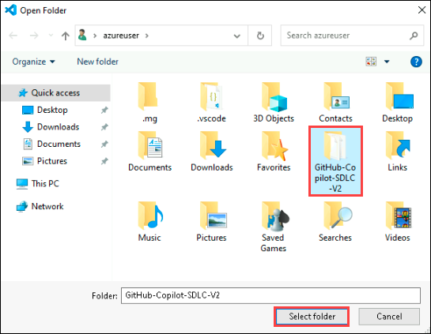

1. Now you will see another screen Do you trust the authors of the files in this folder?. Select the checkbox (1) Trust the authors of all files in the parent folder 'Odl-user-lab' and then click on Yes, I trust the authors (2).

   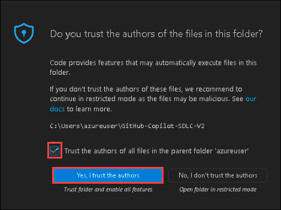

1. Open a new terminal and run the below command.

   ```bash
   cd approvethis
   ```

### 2.2 Create Python Virtual Environment

1. Create and activate a Python virtual environment:

   ```bash
   python -m venv venv
   venv\Scripts\activate
   ```

   > [!TIP]
   > 💡 You should see `(venv)` in your terminal prompt after activation, indicating the virtual environment is active.

### 2.3 Install Dependencies

1. Install the required Python packages:

   ```bash
   pip install -r requirements.txt
   ```

1. This will install Flask, SQLAlchemy, Flask-Login, and other dependencies needed for the application.

### 2.4 Configure Environment Variables

1. Create your local environment configuration:

   ```bash
   cp .env.example .env
   ```

1. Open the `.env` file and review the default settings. For local development, the defaults should work fine:

   ```bash
   FLASK_APP=run.py
   FLASK_ENV=development
   SECRET_KEY=dev-secret-key-change-in-production
   DATABASE_URL=sqlite:///approvethis.db
   FLASK_RUN_PORT=5001
   ```

   > [!IMPORTANT]
   > The `SECRET_KEY` shown here is for development only. In production, this would be a secure, randomly generated value.

### 2.5 Initialize the Database

1. Run database migrations to create the schema:

   ```bash
   flask db upgrade
   ```

### 2.6 Seed the Database

1. Populate the database with initial data (roles and sample users):

   ```bash
   flask seed all
   ```

1. This creates three default users with different permission levels:
   - **viewer** / password: `viewer123` - Read-only access
   - **developer** / password: `developer123` - Can dispatch workflows
   - **admin** / password: `admin123` - Full administrative access

### 2.7 Run the Application

1. Start the Flask development server:

   ```bash
   flask run
   ```

1. You should see output similar to:
   
   ```
    * Running on http://127.0.0.1:5001
    * Restarting with stat
    * Debugger is active
   ```

### 2.8 Verify Application Access

1. Open your browser and navigate to:
   
   ```
   http://localhost:5001
   ```

1. You should see the ApproveThis login page! 🎉

   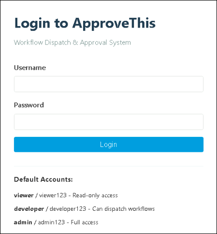

## Step 3: GitHub Copilot Configuration

Let's ensure GitHub Copilot is properly configured in your development environment.

> [!TIP]
> 💡 Refer to the [Glossary](../docs/Glossary.md) anytime you encounter unfamiliar terminology.

### 3.1 Verify Copilot Installation

Open VS Code (or your preferred IDE with Copilot support) and verify:

1. **GitHub Copilot Chat extension is installed**
   - Open the **Extensions** panel
   - Search for "GitHub Copilot"
   - Ensure it's installed and enabled
  
   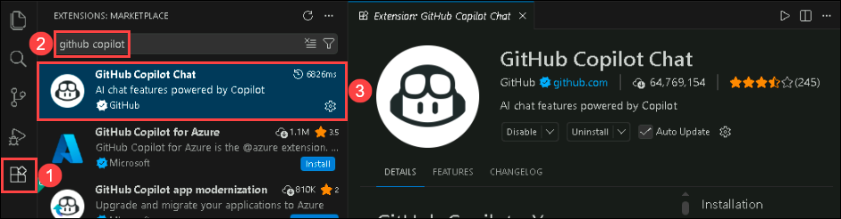

### 3.2 Sign In to GitHub

Ensure you're signed in to the correct GitHub account:

1. Click the GitHub Copilot icon **🤖 Signed out (1)** and then click on **Enable more AI Features (2)** to login.

   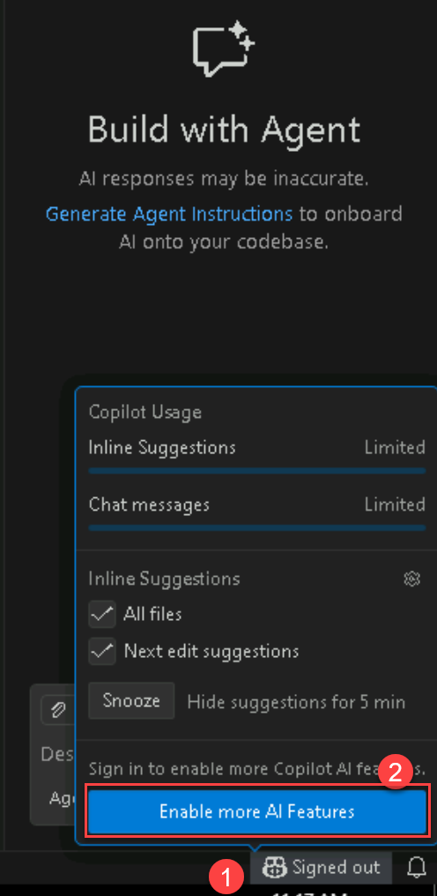

1. Now, on Enable more features tab, click on **Continue with GitHub**. 

   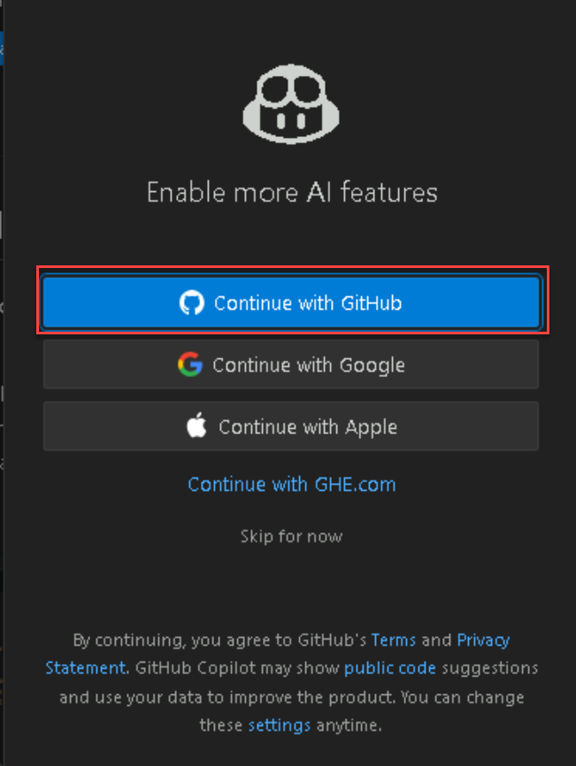

1. Now, in the browser click on **Continue** to Autherize Visual Studio Code. 

   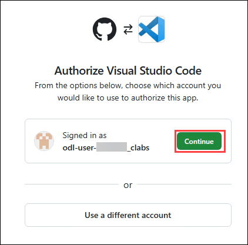

1. On next window, click on **Authrize Visual-Studio-Code**.

   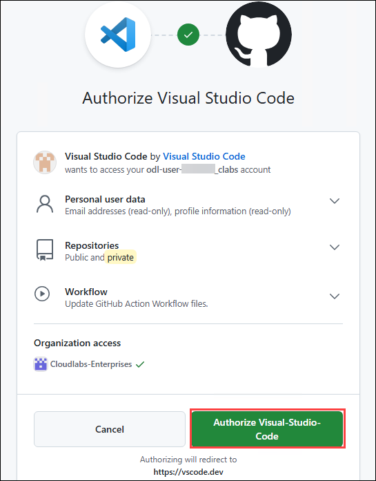

1. You will see a popup asking **This site is trying to open Visual Studio Code**. Enable the **CheckBox** (1) and then click on **Open** (2). It will take you to the VS Code. 

   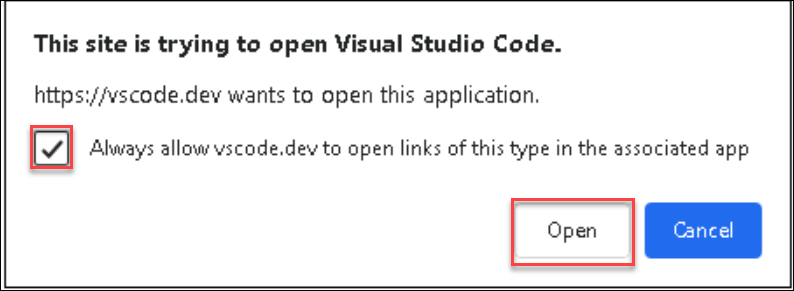

### 3.3 Test Copilot

1. Open the Copilot Chat panel (`Ctrl+Shift+I` / `Cmd+Shift+I`) and try asking:

   <details>
   <summary>💡 Example prompt to test Copilot</summary>

   **Copilot Mode**: `Ask`
   ```
   What is this repository about? Give me a brief overview.
   ```

   </details>

   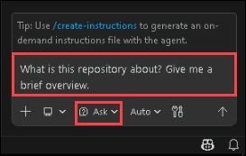

1. Copilot should provide a summary of the ApproveThis application and repository structure.

   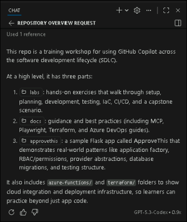

## Step 4: Exploring the Application

Let's take a quick tour of the ApproveThis application to understand what's already built.

### 4.1 Login with Different Roles

Try logging in with each of the three default users to see the permission differences:

1. **Viewer Account:**
   - Username: `viewer`
   - Password: `viewer123`
   - Permissions: Read-only access

1. After logging in, note what you can see:
   - Repositories list
   - Workflows list
   - Workflow runs

1. **Developer Account:**
   - Username: `developer`  
   - Password: `developer123`
   - Permissions: View + Dispatch workflows

1. Notice the additional capability:
   - "Dispatch Workflow" buttons are enabled

1. **Admin Account:**
   - Username: `admin`
   - Password: `admin123`  
   - Permissions: Full access including user management and approvals

1. The admin role has access to all features, including future approval management.

### 4.2 Navigate the Interface

Explore the main sections:

1. **Dashboard** - Overview of recent activity
2. **Repositories** - List of accessible repositories (currently showing mock data)
3. **Workflows** - Available workflows per repository
4. **Runs** - Workflow execution history

   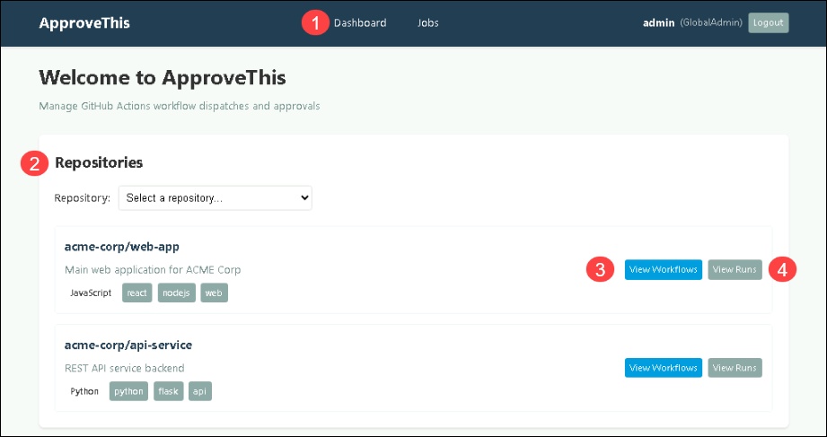

   > [!NOTE]
   > Currently, the application displays **mock data**. In later labs, you'll implement the real GitHub API integration to show live data.

## Step 5: Verify Pre-Configured Secrets

Your repository comes pre-configured with necessary secrets for Azure deployments. Let's verify they're in place.

### 5.1 View Repository Secrets

1. Navigate to your repository on GitHub in a browser
2. Click **Settings** → **Secrets and variables** → **Actions**
3. Confirm the following secrets are present:
   - `AZURE_CLIENT_ID`
   - `AZURE_TENANT_ID`  
   - `AZURE_SUBSCRIPTION_ID`
  
   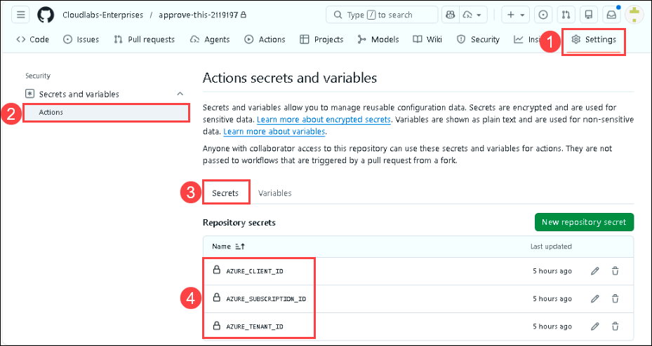

   > [!IMPORTANT]
   > **Do not modify or delete these secrets.** They are pre-configured by your instructor and will be used in Lab 6 for Terraform deployments to Azure.

4. You won't need to access the values, just confirm they exist.

---

## 🏆 Exercise Wrap-Up

Congratulations! You've successfully completed the setup for the GitHub Copilot SDLC Workshop. Let's review what you've accomplished:

### ✅ Success Criteria

- [x] Repository cloned successfully  
- [x] ApproveThis application running locally on http://localhost:5001
- [x] GitHub Copilot active and responding in your IDE
- [x] Successfully logged in to the application with different roles
- [x] Repository secrets verified as present
- [x] Understanding of the ShipIt Industries scenario

## 🤔 Reflection Questions

Take a moment to consider:

1. What differences did you notice between the three user roles (Viewer, Developer, Admin)?
2. How might GitHub Copilot help you understand a new codebase faster than traditional methods?
3. What aspects of the ApproveThis application seem complete vs. incomplete based on your initial exploration?

## 🎓 Key Takeaways

- **Pre-configured environments** save setup time and ensure consistency across workshop participants
- **Role-Based Access Control (RBAC)** allows fine-grained permission management in applications
- **GitHub Copilot** offers multiple interaction modes (Ask, Edit, Agent, Plan) for different workflows
- **Mock data** enables development and testing before live integrations are complete
- The **ApproveThis application** follows Flask best practices including the Application Factory pattern and Blueprint organization

## Coming Up Next

In **Lab 2: Your Assignment**, you'll step into your role at ShipIt Industries and use GitHub Copilot to explore the ApproveThis codebase. You'll discover what's been implemented, identify gaps, and plan your next steps. Get ready to become familiar with a new codebase faster than ever before!

#### You have successfully completed the lab. Click on **Next >>** to continue to the next lab.


