# Exercise 2 - Your Assignment: Understanding ApproveThis

**Duration**: 20 minutes

## 🎯 Learning Objectives

By the end of this lab, you will be able to:
- Use GitHub Copilot to explore and understand an unfamiliar codebase
- Identify implemented vs. unimplemented functionality
- Understand the architecture and patterns used in the application
- Locate extension points for future development
- Plan next implementation steps based on codebase analysis

## 🏢 Your First Day Assignment

You arrive at your desk at ShipIt Industries, coffee in hand, and find a message from your team lead:

> **From**: Erica Mendez (Platform Engineering Lead)  
> **Subject**: Welcome to the team! Your first assignment
> 
> Welcome aboard! Glad to have you on the Platform Engineering team.
> 
> I'm assigning you to ApproveThis - our workflow dispatch and approval system. The previous developer left for another opportunity, and we need someone to pick up where they left off.
> 
> **What's working**:
> - Basic authentication and RBAC
> - UI for browsing repositories and workflows
> - Mock data provider for development
> - Database models and migrations
> 
> **What needs work**:
> - Real GitHub API integration (currently using mock data)
> - Approval workflow system (database models exist but no UI/logic)
> - E2E testing (we have infrastructure but no tests)
> - Multi-platform CI/CD (Connecting to Azure resources, deployments, homegrown systems, etc.)
> 
> **Your task for today**: Get familiar with the codebase. Use whatever tools help you learn fastest. We use GitHub Copilot extensively here - it's great for understanding inherited code.
> 
> I'll check in with you this afternoon. Come prepared with questions and a sense of what you want to tackle first.
>
> Oh, and one more thing. I'm including some example prompts to get you started with Copilot Chat. Feel free to modify them as needed.
> 
> \- Erica

> [!IMPORTANT]
> This lab focuses on **exploration and understanding**, not implementation. We'll build features in later labs. The goal is to map the codebase mentally and identify what's done vs. what's missing. Afterall, it's hard to work on something you don't understand!
>
> Like Erica said, feel free to use the example prompts or adapt them to fit your style. You can also come up with your own questions as you explore. The key is to leverage Copilot to accelerate your learning.

---

## Step 1: Understanding Project Structure with @workspace

Let's start by getting a high-level understanding of the application architecture.

### 1.1 Query the Project Structure

> [!TIP]
> Using **Ask** mode is the go to when working with Copilot to learn about a codebase.

1. Open Copilot Chat and use the `@workspace` participant to ask about the overall structure:

    <details>
    <summary>💡 Example prompt</summary>

    **Copilot Mode**: `Ask`
    ```
    @workspace Can you explain the overall structure of this Python Flask application? What are the main components and how are they organized?
    ```

    </details>

    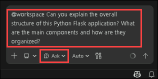

1. **Things to observe:**
    - Copilot will describe the application factory pattern
    - Blueprint-based organization (auth, main, api, jobs)
    - Provider abstraction layer
    - RBAC with Role and Permission models
    - Database models and migrations

### 1.2 Understand the Application Factory Pattern

1. The ApproveThis application uses the **Application Factory Pattern**. If you're unfamiliar with this pattern, ask Copilot to explain it:

   <details>
   <summary>💡 Example prompt</summary>

   **Copilot Mode**: `Ask`
   ```
   What is the Application Factory pattern and how is it implemented in this Flask application? Why is it beneficial?
   ```

   </details>

   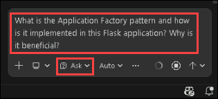

### 1.3 Explore the Blueprint Organization

1. Whether you've worked with Flask and Blueprints before or not, it's helpful to understand how **this** application is organized. Even if it's a common practice in Flask, every project has its own conventions.

1. Let's ask Copilot to detail the blueprints used in the application:

   <details>
   <summary>💡 Example prompt</summary>

   **Copilot Mode**: `Ask`
   ```
   @workspace What blueprints exist in this application and what is each responsible for?
   ```

   </details>

   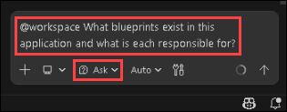

1. **Expected blueprints:**
   
   - `auth` - Authentication and login
   - `main` - Main application routes and views
   - `api` - RESTful API endpoints
   - `jobs` - Job definition and execution management

## Step 2: Understanding the Provider Pattern

One of the key architectural decisions in ApproveThis is the **provider pattern** for external integrations.

### 2.1 Discover the Provider Abstraction

1. Navigate to `approvethis/app/providers/` and explore the files:

1. **Key insights:**
   - `base.py` - Abstract base class defining the provider interface
   - `mock.py` - Mock GitHub implementation returning sample data
   - `github.py` - Placeholder for real GitHub API integration (not yet implemented!)
  
   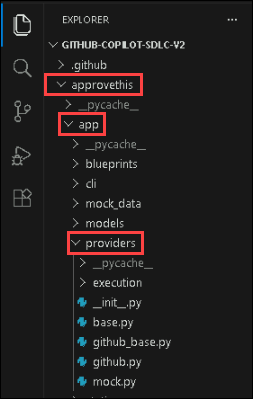

### 2.2 Examine the Base Provider Interface

1. Open `approvethis/app/providers/base.py` and review the abstract methods:

   ```python
   class GitHubProvider(ABC):
       @abstractmethod
       def list_repositories(self): pass
    
       @abstractmethod
       def list_workflows(self, owner, repo): pass
    
       @abstractmethod
       def list_workflow_runs(self, owner, repo, workflow_id=None): pass
    
       @abstractmethod
       def get_workflow_run(self, owner, repo, run_id): pass
    
       @abstractmethod
       def dispatch_workflow(self, owner, repo, workflow_id, ref, inputs): pass
   ```

   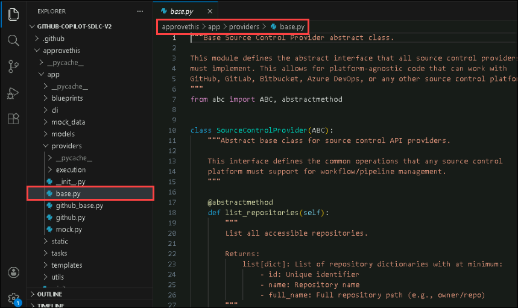

1. If you're unsure about the provider pattern, you can ask Copilot to help you understand it:

   <details>
   <summary>💡 Example prompt</summary>

   **Copilot Mode**: `Ask`
   ```
   @workspace Explain the provider pattern used in app/providers/. What is the purpose of this design pattern?
   ```

   </details>

   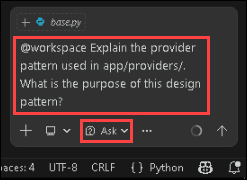

   > [!NOTE]
   > The provider pattern allows switching between mock data (for development) and real API calls (for production) without changing application code. This is a helpful pattern for external service integration.

## Step 3: Identifying Implementation Gaps

Now let's find what needs to be completed. Copilot excels at finding TODOs, NotImplementedErrors, and incomplete code.

### 3.1 Find NotImplementedError Instances

1. Ask Copilot to locate unimplemented functionality:

   > [!TIP]
   > Use Copilot with `@workspace` to search for any of the things mentioned above.
   
   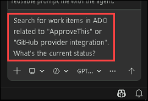

1. **Potential findings:**
   - `app/utils/form_builder.py` - TODO comments for parsing yaml
   - `app/providers/github.py` - All methods raise `NotImplementedError`
   - `app/providers/execution/azure_function.py` - Placeholder for Azure Function execution
   - Potentially missing routes for job execution

### 3.2 Examine the GitHub Provider Placeholder

1. Open `approvethis/app/providers/github.py`:

   ```python
   class RealGitHubProvider(GitHubProvider):
       def list_repositories(self):
           raise NotImplementedError("Real GitHub provider not yet implemented")
    
       def list_workflows(self, owner, repo):
           raise NotImplementedError("Real GitHub provider not yet implemented")
       # ... etc
   ```

   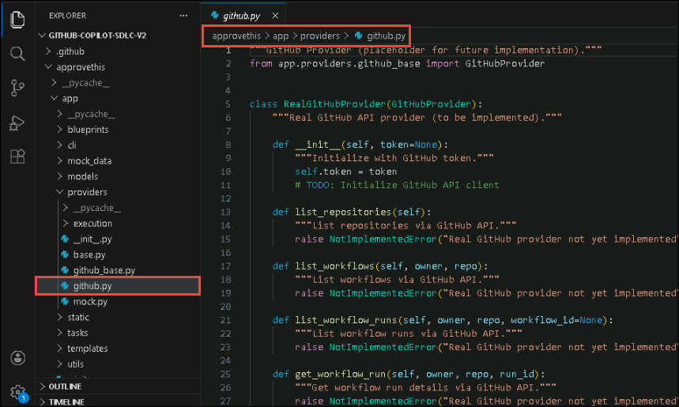

1. This is a key feature that needs implementation!

### 3.3 Explore the Jobs Blueprint

1. Check if the jobs blueprint has complete routes:

   <details>
   <summary>💡 Example prompt</summary>

   **Copilot Mode**: `Ask`
   ```
   @workspace Does the jobs blueprint in app/blueprints/jobs/ have routes implemented? What functionality is available vs. what's missing?
   ```

   </details>

   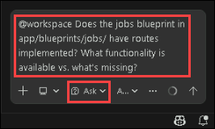

1. Look at the models in `app/models/`:
   - `job_definition.py` - Defines job templates
   - `job_execution.py` - Tracks job execution history
   - `execution_target.py` - Defines where jobs can execute
  
   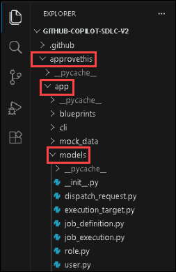

1. These models exist, but may not have complete route or UI support yet.

## Step 4: Understanding RBAC Implementation

ApproveThis implements Role-Based Access Control. Let's understand how it works.

### 4.1 Explore Permission Definitions

1. Open `approvethis/app/models/role.py` and examine the `Permission` class:

   ```python
   class Permission:
       VIEW_REPOS = 1
       VIEW_WORKFLOWS = 2
       VIEW_RUNS = 4
       DISPATCH_WORKFLOW = 8
       MANAGE_APPROVALS = 16
       MANAGE_USERS = 32
       ADMIN = 64
   ```

   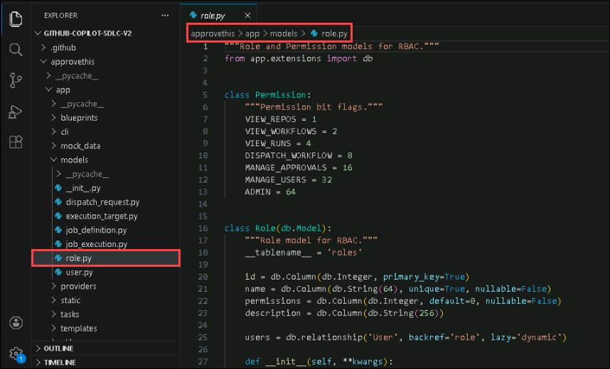

1. This class uses powers of 2 to define permissions. We don't know exactly why yet, so let's ask Copilot to help explain it to us:

   <details>
   <summary>💡 Example prompt</summary>

   **Copilot Mode**: `Ask`
   ```
   Explain how the Permission class in app/models/role.py implements permission flags. Why use powers of 2?
   ```

   </details>

   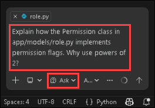

<!-- > [!TIP]
> 💡 Using powers of 2 allows combining multiple permissions with bitwise operations. A role can have permissions 1 + 2 + 4 = 7, representing VIEW_REPOS, VIEW_WORKFLOWS, and VIEW_RUNS. -->

### 4.2 Review Default Roles

1. The `Role.insert_roles()` method creates three default roles:

   - **Viewer**: VIEW_REPOS, VIEW_WORKFLOWS, VIEW_RUNS
   - **LeadDeveloper**: Previous + DISPATCH_WORKFLOW  
   - **GlobalAdmin**: All permissions including MANAGE_APPROVALS

1. Notice that `MANAGE_APPROVALS` permission exists but isn't fully utilized yet. Keep this in mind for later!

### 4.3 Check Permission Enforcement

1. Ask Copilot how permissions are enforced:

   <details>
   <summary>💡 Example prompt</summary>

   **Copilot Mode**: `Ask`
   ```
   @workspace How are permissions checked in the application routes? Show me examples of permission enforcement.
   ```

   </details>

   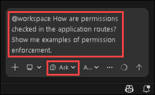

1. Look for the `@permission_required` decorator usage in route files.

---

## 🏆 Exercise Wrap-Up

Excellent work! You've used GitHub Copilot to rapidly understand the ApproveThis codebase. Let's review what you discovered:

### ✅ What You Accomplished

- [x] Understood the application factory pattern and blueprint organization
- [x] Explored the provider pattern for external API abstraction
- [x] Identified unimplemented features (GitHub provider, execution providers)
- [x] Understood the RBAC system and permission model  
- [x] Reviewed database models including approval-related fields
- [x] Created a prioritized list of remaining work

## 🤔 Reflection Questions

Take a moment to consider:

1. How much faster was exploring this codebase with Copilot compared to reading files manually?
2. What questions did Copilot help you answer that might have taken significant time to discover on your own?
3. Which architectural patterns (factory, provider, RBAC) were new to you? Which were familiar?
4. How might you use Copilot for onboarding in your real-world projects?

## 🎓 Key Takeaways

- **@workspace participant** gives Copilot full project context for comprehensive answers
- **Architectural patterns** like provider abstraction enable clean separation of concerns
- **NotImplementedError and TODOs** are clear markers for incomplete functionality
- **Database models** often contain fields for future features before UI is implemented
- **Copilot accelerates onboarding** by answering questions about code structure, patterns, and dependencies
- **Understanding before implementing** leads to better design decisions

## Coming Up Next

In **Lab 3: Planning with MCP**, you'll take your understanding to the next level. You'll set up Model Context Protocol (MCP) servers to connect Copilot with Azure DevOps, allowing you to query work items, create user stories, and plan features with full project management context. Get ready to see how Copilot extends beyond code!

#### You have successfully completed the lab. Click on **Next >>** to continue to the next lab.


