# Exercise 4 - Shifting Our Development Process

**Duration**: 60 minutes

## 🎯 Learning Objectives

By the end of this lab, you will be able to:
- Delegate implementation tasks to GitHub Copilot Coding Agent
- Trigger and manage coding agent tasks from VS Code using @cloud
- Monitor and steer coding agent progress using Agent Panel and Mission Control on GitHub.com
- Use GitHub Copilot Code Review to ensure code quality
- Work iteratively with AI assistance for complex features
- Apply best practices for AI-assisted development with autonomous agents

## 🏢 Implementation Day at ShipIt Industries

Erica reviews your planning work and gives you the green light to start implementing:

> **Erica**: "Great planning! The work items look solid, and I love the detailed acceptance criteria. Now let's build it!
>
> For the GitHub provider, I'd recommend having Copilot help you come up with an implementation plan, and then delegate the implementation to a Copilot Coding Agent. This is a complex task that will touch multiple files, add dependencies, and needs to follow our established patterns which is perfect for a coding agent to handle autonomously.
>
> You can trigger the coding agent right from Copilot Chat and monitor its progress in real-time on GitHub.com using Mission Control. While it's working, you'll want to brush up on Mission Control and the Agent Panel so you can steer the agent as needed.
>
> Oh, and make sure you Copilot for Code Review throughout the process to ensure quality. Let me know if you have any questions!"

Let's implement the real GitHub API provider following ShipIt's development workflow!

---

## Step 1: Creating an Implementation Plan with Plan Mode

Before diving into code, let's use Copilot's Plan mode to create a structured implementation approach.

### 1.1 Open Copilot Chat in Plan Mode

From the Copilot Chat panel, click the mode selector dropdown at the bottom of the chat and select **Plan** mode.

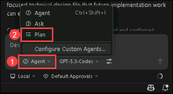

Plan mode is designed to help you think through implementation strategies before writing code. It creates a structured outline that you can review and refine.

### 1.2 Request an Implementation Plan

Ask Copilot to create a detailed implementation plan for the GitHub provider task in ADO:

<details>
<summary>💡 Example planning prompt</summary>

> [!NOTE]
> You need to replace `XXX` with the actual Azure DevOps work item ID for the GitHub provider task.

**Copilot Mode**: `Plan`
```
I need to implement the real GitHub provider. The work item is in Azure DevOps under ID XXX. Please help me create an implementation plan.
```

</details>

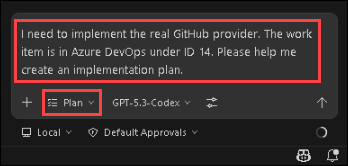

### 1.3 Review the Generated Plan

Copilot will generate a structured implementation plan. Review it for:

✅ **Completeness:**
- Does it cover all methods in the `base.py` interface?
- Are dependencies like PyGithub identified?
- Is authentication strategy addressed?

✅ **Correctness:**
- Does the approach align with existing patterns in the codebase?
- Are the steps in a logical order?
- Does it follow the guidelines in `.github/copilot-instructions.md`?

✅ **Feasibility:**
- Are the steps actionable?
- Is the scope appropriate for the task?

### 1.4 Refine the Plan as Needed

If the plan needs adjustments, ask Copilot to refine specific sections:

<details>
<summary>💡 Example refinement prompts</summary>

**Copilot Mode**: `Plan`
```
Can you expand the error handling section to include specific GitHub API error codes we should handle?
```

```
Add a section for caching strategy to minimize API calls and respect rate limits.
```

```
Include steps for updating the configuration to switch between mock and real providers.
```

</details>

## Step 2: Delegating to GitHub Copilot Coding Agent

Now that we have a solid implementation plan from Step 1, it's time to delegate the actual coding work to GitHub Copilot Coding Agent. The Copilot Coding Agent is an autonomous AI agent that works in a secure GitHub cloud environment, handling the implementation while you monitor and steer its progress.

### 2.1 Understanding Copilot Coding Agent

Before we trigger the agent, let's understand what makes it special:

**Key Characteristics:**
- Runs autonomously in a secure GitHub cloud environment (not on your machine)
- Creates a draft pull request with its changes
- Can be monitored and steered in real-time from GitHub.com
- Provides detailed session logs and progress tracking
- Frees you up to focus on other tasks while it works

Think of the Coding Agent as a junior developer on your team. You assign it a task with clear instructions, it goes off to work independently, and you can check in on progress or provide guidance as needed.

### 2.2 Delegating the Task from Chat

> [!IMPORTANT]
> Currently Coding Agent sessions triggered from VS Code can only branch from the default branch (e.g., `main` or `master`).

Now let's delegate the GitHub provider implementation to the Coding Agent directly from VS Code.

There are 2 different ways to delegate to the Coding Agent:

#### Method 1: Continuing from the Implementation Plan

1. **While still in `Plan` Mode**, click the down arrow next to `Start Implementation` at the bottom of the plan:
   
1. Select `Continue in Cloud` to delegate the task to the Coding Agent

   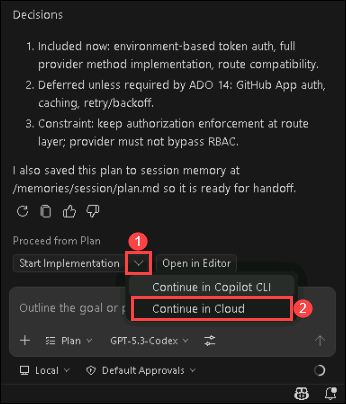

   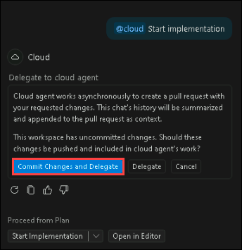

1. If the Coding Agent fails to run the session, then it may be possible that the github username and user email are not configured. Provide the Copilot your github user name and user email and then delegate.

   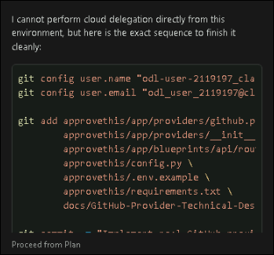

#### Method 2: Using @cloud in Copilot Chat

1. In Copilot Chat, enter a prompt starting with `@cloud`
2. Describe the task you want the Coding Agent to perform, referencing the implementation plan you created earlier

   ```
   @cloud implement the GitHub provider based on the implementation plan we created above.
   ```

   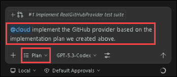
   
3. **Submit the prompt**. Copilot will confirm the delegation and the Coding Agent will:
   - Create a new branch for the work
   - Begin implementing the changes in the cloud environment
   - Open a draft pull request to track progress

> [!TIP]
> You can also type out your prompt, then click the arrow on the right of the input box and select `Cloud` from the options to trigger a Coding Agent session.

### 2.3 Understanding the Agent Panel on GitHub.com

Once you've delegated the task, the Coding Agent starts working independently. One of the methods you can use to monitor its progress on GitHub.com is the **Agent Panel**.

#### Accessing the Agent Panel

1. **Navigate to GitHub.com** in your browser
2. Open your repository for this lab
3. Click on the **Agent Panel** in the top right of the page (it's next to the Copilot icon)

   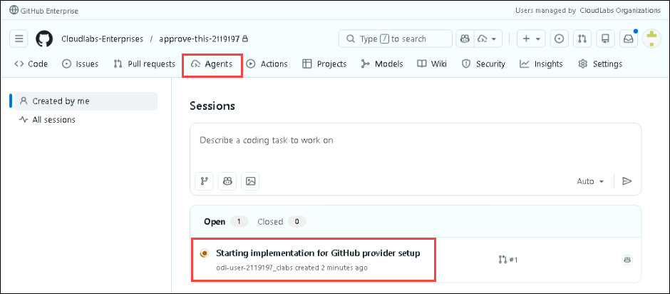

#### What You'll See in the Agent Panel

The Agent Panel provides a simplified view of all your Copilot Coding Agent tasks:

**Key Information:**

1. **Active/Recent Sessions**
   - Current status (Working, Completed, Failed)
   - Time elapsed
   - Associated repository

2. **Quick Actions**
   - Click into any active session to view details
   - Access session logs
   - `View All` to view all Coding Agent sessions in Mission Control
   - Quickly start a Coding Agent task with the prompt input. 
     - You can specify the repo, branch, and custom agent before submitting

### 2.4 Exploring Mission Control

The other method of monitoring and controlling Coding Agent sessions is **Mission Control**. This is GitHub's centralized dashboard for managing all your AI coding agent tasks. This is where the real power of autonomous agents shines!

You can access Mission Control at **[github.com/copilot/agents](https://github.com/copilot/agents)**.

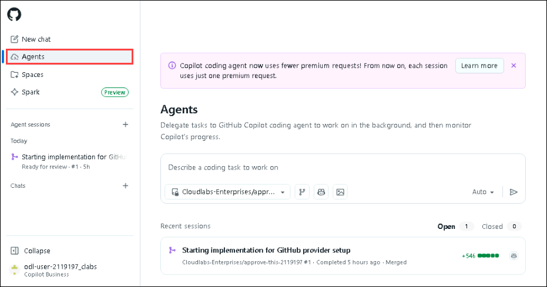

#### Mission Control Features

Mission Control provides a **unified, real-time dashboard** for all your Copilot Coding Agent tasks:

**Key Features:**

1. **Task Overview**
   - See all active, completed, and failed agent sessions at a glance
   - View status indicators for each task
   - Quickly jump between multiple agent sessions

2. **Session Details**
   - Click any task to see detailed information:
     - Session logs showing the agent's reasoning
     - Files changed with inline diffs
     - Build and test results (if applicable)
     - Timeline of agent actions
     - Associated pull request

3. **Task Switcher**
   - Easily switch between multiple agent tasks
   - Filter by status (active, completed, failed)
   - See which tasks need your attention

4. **Cross-Repository View**
   - See agent tasks across all your repositories
   - Perfect for teams managing multiple projects

**Why Mission Control Matters:**

- **No more tab juggling**: Everything you need is in one place. No hunting through issues, PRs, and comments
- **Real-time visibility**: See exactly what your agents are doing as they work
- **Historical tracking**: Review past agent sessions to learn from their approach
- **Team coordination**: See what coding agents are working on across your team

### 2.5 Real-Time Steering from Mission Control

One of the most powerful features of Copilot Coding Agent is **real-time steering**. The ability to provide guidance while the agent is actively working, not just after it completes.

#### How to Steer Your Coding Agent

From Mission Control on GitHub.com:

1. **Navigate to your active agent session** in the Agent Panel
2. **View the session details** to see what the agent is currently doing
3. **Use the chat input** at the bottom of the session view to send messages to the agent
4. The agent will **see your feedback and adapt** as soon as its current task completes

   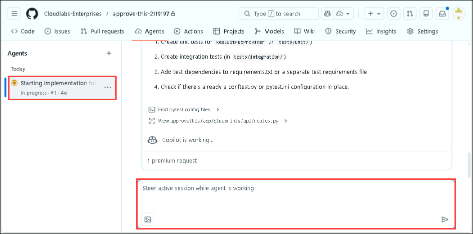

**Example Steering Messages:**

- "Make sure to add comprehensive error handling for API timeouts"
- "Use the logging pattern from utils.py instead of print statements"
- "Don't forget to update the configuration file with the new provider"
- "Add type hints to all function parameters"
- "Focus on getting the basic implementation working first, skip the caching for now"

#### When to Steer

- **Course Correction**: When you see the agent going down the wrong path
- **Additional Requirements**: When you remember something that should be included
- **Style Preferences**: When you want to ensure consistency with team standards
- **Priority Adjustments**: When you need to refocus the agent's efforts

> [!IMPORTANT]
> Real-time steering makes human-AI collaboration truly iterative. You don't need to wait for the agent to finish, review everything, and request changes. You can guide the work as it happens, saving significant time.

#### Best Practices for Steering

- **Be specific**: Instead of "this doesn't look right," say "use async/await for the API calls"
- **Provide context**: Reference specific files, functions, or patterns in the codebase
- **Intervene early**: If you see issues developing, steer immediately
- **Trust but verify**: The agent is capable, but your domain knowledge is valuable

### 2.6 Reviewing the Coding Agent's Work

Once the Coding Agent completes its task, it's time to review the pull request.

#### Where to Review

1. **On GitHub.com** (Recommended)
   - Navigate to the pull request in your repository
   - Review the **Files Changed** tab
   - Check the **Session Logs** in Mission Control to understand the agent's decision-making
   - Look at any automated checks or tests

   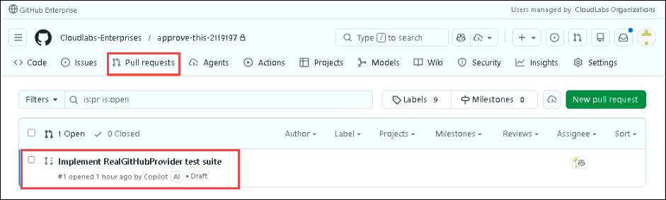

2. **In VS Code** (Optional)
   - Open the **GitHub Pull Requests** extension
   - Find the agent's draft PR
   - Review changes with VS Code's diff viewer
   - Test locally by checking out the branch
  
   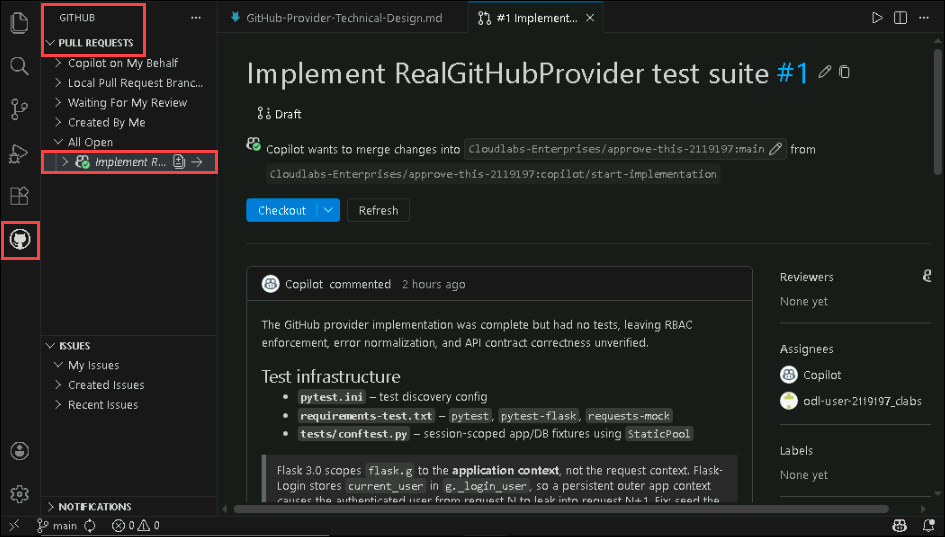

#### What to Check For

✅ **Correctness:**
- Does it implement all methods from the plan?
- Are the dependencies correctly added to `requirements.txt`?
- Is the authentication strategy implemented as planned?

✅ **Code Quality:**
- Proper error handling with try/except blocks
- Rate limiting awareness for API calls
- Consistent with existing code patterns
- Appropriate logging

✅ **Completeness:**
- All files mentioned in the plan are updated
- Configuration is updated correctly
- No obvious missing pieces

> [!IMPORTANT]
> Even though the Coding Agent is highly capable, you are still responsible for the final code quality. Always review carefully before merging. The agent is a powerful assistant, not a replacement for human judgment.

### 2.7 Testing the Implementation

Let's test the GitHub provider implementation to ensure it works correctly:

1. **Check out the agent's branch** in VS Code:
    - Open the GitHub Pull Requests panel
    - Click on `Copilot on My Behalf`
    - Select the PR created by the agent
    - Review and Merge the PR
  
    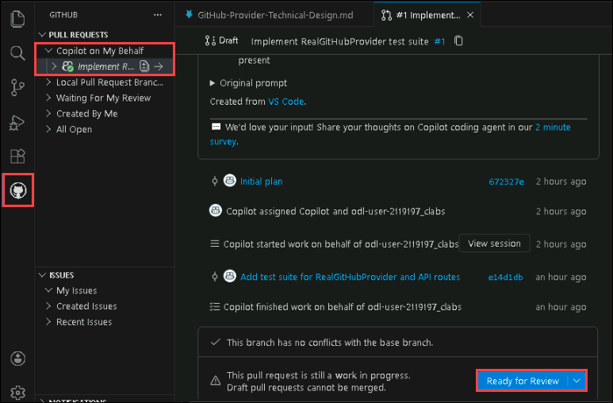

    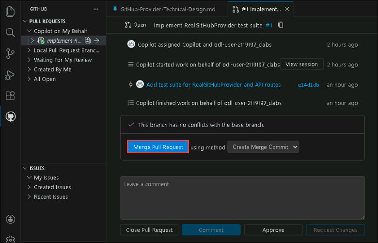

3. **Install any new dependencies** (ensure you are in the approvethis directory inside the terminal):
   ```bash
   pip install -r requirements.txt
   ```

4. **Set up your GitHub token** according to the implementation:
   ```bash
   export GITHUB_TOKEN="your-token-here"
   ```

5. **Run the application** and test the GitHub provider:
   - Start the application
   - Navigate to the repository listing section
   - Verify repositories load from your GitHub account
   - Test workflow listing and other features
  
   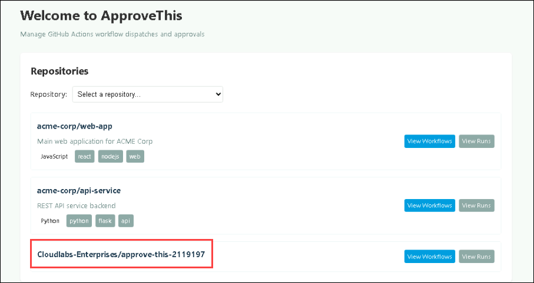

   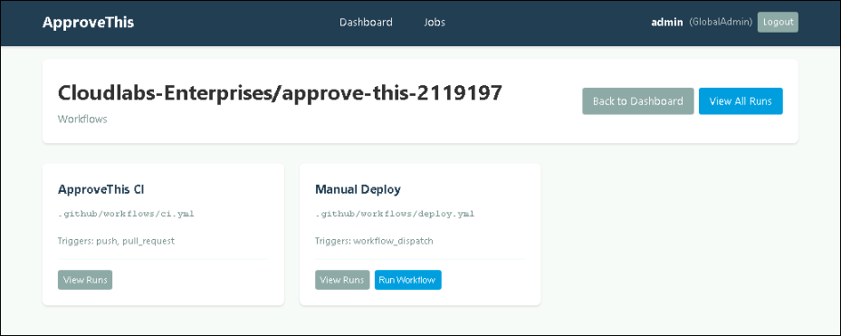

7. **Check the logs** for any errors or warnings

### 2.8 Iterating with the Coding Agent

If the initial implementation needs adjustments:

1. **Provide feedback in Mission Control**: Tell the agent what needs to change via the chat input. This is the same input that you used for real-time steering.
2. **Add review comments on the PR**: Use GitHub's review tools to leave specific comments on lines of code that need changes. When you are done with the review, tag `@copilot` in your review summary to have Coding Agent address the comments.
3. **Alternatively, make fixes yourself**: For minor issues, it may be faster to make the change directly in the PR

The beauty of the Coding Agent is that it can iterate just like a human developer. You provide feedback, it makes adjustments, and you review again.

## Step 3: Documenting Changes

One of the areas were Copilot really shines is in generating documentation. Historically this has been a tedious task that many developers skip or do poorly. However, with Copilot we can generate high quality documentation quickly and easily.

Copilot does a good job of following documentation best practices automatically, but you can also provide specific instructions to ensure it meets your team's standards.

### 3.1 Generate Docstrings

Ask Copilot to add comprehensive docstrings:

<details>
<summary>💡 Example prompt</summary>

**Copilot Mode**: `Agent`
```
Add comprehensive docstrings to all methods in app/providers/github.py following Google style guide format. Include parameters, return types, exceptions raised, and usage examples.
```

</details>

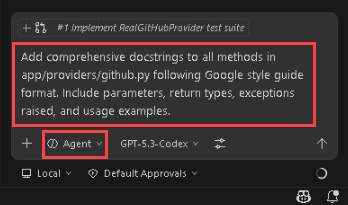

### 3.2 Create API Documentation

Now let's add some user-facing documentation for our GitHub provider:

<details>
<summary>💡 Example prompt</summary>

**Copilot Mode**: `Agent`
```
Create API documentation for the GitHub provider in Markdown format. Include:
- Overview of functionality
- Configuration requirements (environment variables)
- Available methods with parameters  
- Example usage
- Error handling information
- Rate limiting considerations
Save this as docs/GitHub-Provider-API.md
```

</details>

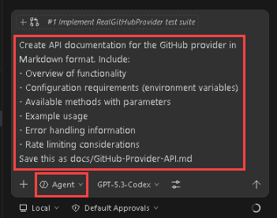

## Step 4: GitHub Copilot Code Review

Now that the Coding Agent has completed its work (or you've made additional changes), it's time to get a code review before we finalize everything.

### 4.1 Request a Code Review

GitHub Copilot can perform an automated code review on the pull request created by the Coding Agent, or on any uncommitted changes you've made.

**For the Coding Agent's Pull Request:**

1. Navigate to the pull request on GitHub.com
2. The Coding Agent may have already requested a self-review, but you can request an additional review for thoroughness
3. Look for Copilot's automated review comments and suggestions

**For Uncommitted Changes:**

1. Open the Source Control panel (`Ctrl+Shift+G`)
2. Click the **Code Review** button at the top of the panel on the `CHANGES` section (looks like a message box with `<>` in it)
3. Copilot will analyze your uncommitted changes and provide feedback through inline comments in the diff view

### 4.2 Apply Suggested Improvements

Review Copilot's suggestions and apply the ones that make sense:

**Common review suggestions might include:**
- Adding error handling for edge cases
- Improving variable or function names for clarity
- Adding type hints or additional documentation
- Addressing potential security vulnerabilities
- Optimizing performance-critical sections
- Ensuring consistent code style with the rest of the codebase

> [!TIP]
> If the Coding Agent is still active and you find issues during review, you can provide feedback directly in Mission Control, and it will make the necessary corrections.

## Step 5: Finishing Up

Now that we've reviewed the Coding Agent's implementation, tested it, documented it, and had Copilot review the code, it's time to finalize our work.

### 5.1 Generating Commit Messages

If you've made additional commits on top of the Coding Agent's work, Copilot can help you create detailed commit messages that follow best practices.

To have Copilot generate a commit message for your changes:

1. Open the `Source Control panel` (`Ctrl+Shift+G`)
2. Stage your changes
3. Click into the **commit message** input box
4. Click the **Generate Commit Message** button (sparkle icon ✨) at the end of the input box
5. Review and edit the generated message as needed

   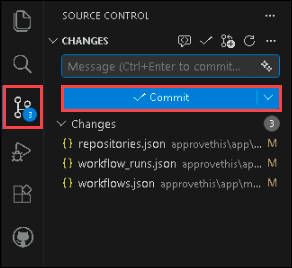

### 5.2 Sync Our Changes

For this lab, we'll keep the PR as a draft and not merge it yet. We will be using the PR to demonstrate deployments in the a later lab so make sure all your changes are pushed to GitHub.

1. Push any additional commits you've made locally to the Coding Agent's branch

> [!NOTE]
> The Coding Agent's PR is already on GitHub since it works in the cloud. You only need to push if you made additional local changes on top of the agent's work.

---

## 🏆 Exercise Wrap-Up

Excellent work! You've experienced how AI transforms the development phase of the SDLC. Let's review what you accomplished:

### ✅ What You Accomplished

- [x] Created a detailed implementation plan using Plan mode
- [x] Delegated complex implementation work to GitHub Copilot Coding Agent using @cloud
- [x] Monitored autonomous agent progress using the Agent Panel on GitHub.com
- [x] Explored Mission Control for centralized agent task management
- [x] Used real-time steering to guide the coding agent from Mission Control
- [x] Performed comprehensive code review with Copilot assistance
- [x] Tested and validated the agent's implementation
- [x] Learned to work with autonomous AI agents as team members
- [x] Generated documentation using Agent mode and commit messages with AI assistance

## 🤔 Reflection Questions

Take a moment to consider:

1. How does delegating to an autonomous Coding Agent using @cloud change your development workflow compared to traditional coding?
2. What types of tasks are best suited for Coding Agents vs. tasks you should handle yourself?
3. How did real-time steering from Mission Control improve your ability to guide the agent's work?
4. What value does the Agent Panel on GitHub.com provide when managing coding agent tasks?
5. How would you integrate Coding Agents into your team's workflow? What guidelines would you establish?
6. What surprised you most about the Coding Agent's capabilities or limitations?

## 🎓 Key Takeaways

- **Copilot Coding Agent** works autonomously in the cloud, enabling true delegation of development tasks
- **@cloud delegation** from VS Code Chat provides a seamless way to hand off complex tasks
- **Mission Control on GitHub.com** provides centralized visibility and management for all AI coding agent tasks
- **Agent Panel** shows real-time progress and historical sessions for all your coding agents
- **Real-time steering** allows you to guide agents as they work from Mission Control, not just after completion
- **Autonomous agents** can handle complex, multi-file tasks while you focus on architecture and review
- **Transparency and trust** come from detailed session logs showing agent reasoning and decisions
- **Human oversight remains critical** as agents are powerful assistants, not replacements for developer judgment
- **Governance policies** (from `.github/copilot-instructions.md`) ensure agents follow team standards automatically

## Coming Up Next

In **Lab 5: Testing Isn't an Afterthought Anymore**, you'll discover how GitHub Copilot transforms testing from a chore into an integrated part of development. You'll generate comprehensive unit tests, implement end-to-end testing with Playwright, and see how AI can identify edge cases you might miss. Building on the GitHub provider implementation from this lab, you'll achieve better test coverage in less time!
