# Exercise 5 - Testing Isn't an Afterthought Anymore

**Duration**: 30 minutes

## 🎯 Learning Objectives

By the end of this lab, you will be able to:
- Use GitHub Copilot to generate comprehensive test suites
- Set up and configure Playwright for end-to-end (E2E) testing with Flask
- Implement unit tests for models, providers, and routes
- Create E2E tests that validate complete user workflows
- Understand AI-assisted test-driven development (TDD)
- Identify edge cases and negative test scenarios with Copilot

## 🏢 Testing Culture at ShipIt Industries

After reviewing your GitHub provider implementation, Erica emphasizes testing:

> **Erica**: "Nice work on the provider! But before we merge this, we need tests. At ShipIt, we have a rule: **no code ships without tests**.
>
> Here's our testing pyramid:
> - **Unit tests**: Fast, isolated, test individual functions and classes
> - **Integration tests**: Test API endpoints and database interactions
> - **E2E tests**: Test full user workflows in the browser
>
> The good news? Copilot is excellent at writing tests. It understands our code and can generate comprehensive test suites. Let me show you how we use it."

This lab demonstrates how AI can transform testing from a tedious chore into a rapid, thorough process.

> Testing is crucial for:
> - Preventing regressions when adding features
> - Documenting expected behavior
> - Building confidence in deployments
> - Enabling refactoring safely
> 
> Copilot makes it easier to achieve high test coverage without the usual time investment.

---

## Step 1: Understanding the Testing Strategy

Let's start by understanding what we need to test and setting up the infrastructure.

### 1.1 Review Existing Test Structure

> For this lab we want to make sure we start with a new Copilot chat session focused on testing. This will ensure that Copilot is in the right context for generating tests. 
>
> Steps that should use a new chat session will be clearly indicated.
>
> Continue using the same chat sessions unless otherwise instructed.

1. First start a new Copilot chat session.

2. Have Copilot analyze the existing test setup and if there are any gaps currently. 

   <details>
   <summary>💡 Example analysis prompt</summary>

   **Copilot Mode**: `Ask`
   ```
   What testing infrastructure exists in the `tests/` directory? What's already set up and what's missing?
   ```

   </details>

   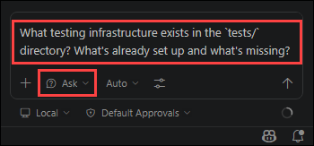

3. **You should find**:
   - `tests/` directory exists
   - Possibly some basic structure but minimal tests
   - May have pytest configuration or conftest.py

### 1.2 Plan Test Coverage

1. Now that we know the current state, let's plan out the tests we need to create for comprehensive coverage. Given that we have mutliple testing levels (unit, integration, E2E), we need a structured plan. Let's have Copilot help us plan this out:

   **Copilot Mode**: `Plan`
   ```
   Based on the `ApproveThis` codebase and the rough outline in `tests/testing-strategy.md`, create a comprehensive test plan covering:

   1. Unit tests:
      - Models (User, Role, Permission, DispatchRequest)
      - RBAC permission checking
      - Provider classes (MockGitHubProvider, RealGitHubProvider)
      - Utility functions

   2. Integration tests:
      - API endpoints (repositories, workflows, dispatch)
      - Authentication flows
      - Permission enforcement in routes

   3. E2E tests:
      - User login and navigation
      - Viewing repositories and workflows
      - Dispatching a workflow (as LeadDeveloper)
      - Permission denials (as Viewer)

   List test files to create and what each should cover.
   ```

   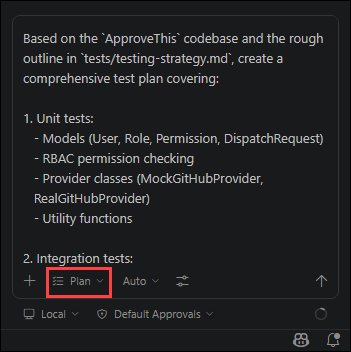

1. Compare the plan generated by Copilot to the rough outline in `tests/testing-strategy.md`. Does it align? Are there any additional tests or areas Copilot suggests? 

1. If necessary, refine the plan to ensure all critical areas are covered.

1. **FINALLY**, once the plan is solidified, we want to save it temporarily. 

1. We can quickly do this by clicking the **Open in Editor** button in the Copilot chat window. 

   > If you do not see this button you need to switch back in to `Plan` mode.
   
   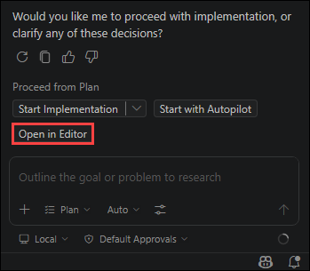

1. Once Copilot finishes processing you will have a new file opened in your editor with the contents of the plan Copilot generated.

   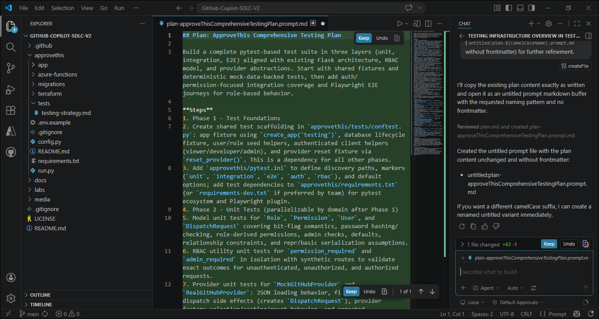

1. Save this file as `test_plan.md` in the `tests/` directory for reference throughout the rest of the lab.

   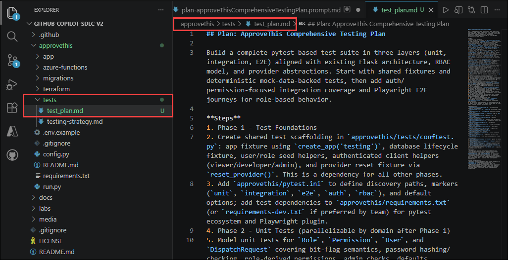

## Step 2: Setting Up the Testing Infrastructure

Now that we have our plan we're all set to systematically create the tests. Just as you're about to start you get a message from Erica:

> **Erica**: "Hey there! I know you're working on getting the tests set up since I asked you to and everything. 
>
> BUT, we just had some urgent work come up that we're going to need you to get working on as soon as you have this initial version of ApproveThis set up and tested.
>
> So..... can you please try to expedite the testing setup? We need to get this done quickly so we can move on to the next priority. Once you have the testing infrastructure in place, just document any issues you run into and we can address them later after the urgent work is done.
>
> Thanks!"

With timing as great as this it's lucky that Copilot can help us rapidly set up the testing infrastructure.

While normally we would want to implement the different testing types separately and go through them in a methodical manner, we don't have that option right now. 

So instead, we're going to leverage Copilot's `Agent` mode to build out the entire testing infrastructure plan we came up with in the previous step. 

### 2.1 Full Testing Infrastructure Setup

1. Since we already have a plan, we can ask Copilot to implement the entire testing infrastructure in one go. You want to be sure to include any additional direction you think is necessary when having Copilot implement the plan:

   **Copilot Mode**: `Agent`
   ```
   I need you to take the comprehensive test plan we created (`tests/test_plan.md`) and implement the full testing infrastructure for the ApproveThis application. Make sure to: 

   - Install any dependencies needed
   - Set up pytest configuration
   - Create the necessary test files and directories according to the plan
   - Ensure that the tests are organized by type (unit, integration, E2E) and cover all critical areas outlined in the plan

   Once you are done, please ensure that all tests run correctly, and provide a summary of what was created and any instructions needed to run the tests.
   ```

   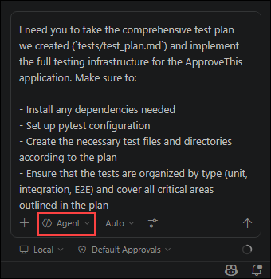

1. Once you submit this prompt, Copilot will begin working through the entire testing infrastructure setup. Since this could take a little while we are going to work on something else while we wait. Click **Keep** to update the changes provided by Copilot and then **Allow** for any setup/commands to be run.

   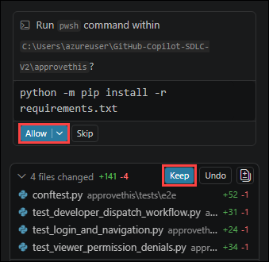

## Step 3: The Power of Parallel Development

One of the benefits of using Copilot is the ability to work on multiple tasks in parallel. While Copilot is working on the testing infrastructure, you can start analyzing and planning test implementations for some of the future work we have to do.

> You can switch between different Copilot chat sessions using the Copilot pane in VS Code. Just click on the session you want to interact with.
>
> If you're unfamiliar with this feature, refer to the [Manage agent sessions](https://code.visualstudio.com/docs/copilot/agents/overview#_manage-agent-sessions) in the vs code documentation.

### 3.1 Analyzing Our Test Plan

1. In a later lab we will be implementing the functionality to allow users to approve or reject workflow dispatch requests. This will be a critical part of the application and will require thorough testing.

1. So while Copilot is busy building out the testing infrastructure, let's have it analyze our test plan and identify what it thinks the most critical tests will be for this new functionality.

1. First start a new Copilot chat session.

   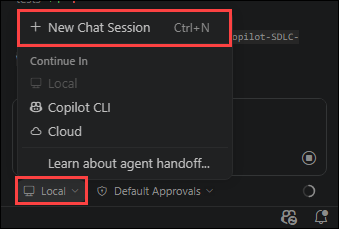
   
1. Ask Copilot to analyze the test plan for critical test cases related to the approval workflow feature:

   **Copilot Mode**: `Ask`
   ```
   Based on the test plan we created (`tests/test_plan.md`), what are the most critical test cases for the approval workflow feature we'll build in `Lab 8`? 

   Prioritize them by risk.
   ```

   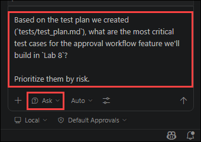

1. Take a look at the test cases Copilot identifies. Are there any you hadn't considered?

   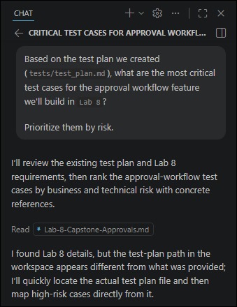

1. Having the ability to run multiple Copilot sessions in parallel allows you to make progress on multiple fronts simultaneously, speeding up development significantly. For now, let's return to our main task.

## Step 4: Review and Validate the Testing Infrastructure

By now Copilot should have completed the testing infrastructure setup. If not give it a few more minutes.

Before moving on, let's do a quick functional verification of each test layer to ensure everything is working correctly. As **Erica** indicated we don't have time for deep debugging, so we're just confirming the basics work.

For all of the following steps, make sure to be in the main `approvethis/` directory.

```bash
cd approvethis
```

### 4.1 Unit Tests

Unit tests should run the fastest and be the most straightforward to verify.

1. **Run the unit tests** to verify the basic infrastructure is working:

   ```bash
   pytest tests/unit/ -v --tb=short
   ```

2. **Expected outcome**: Tests should execute (pass or fail) without import errors or configuration issues. If you see `collected X items` and tests run, the infrastructure is working.

   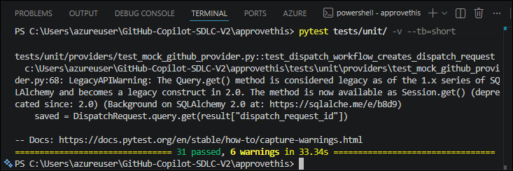

   > If tests fail due to missing dependencies or import errors, ask Copilot to help fix them:
   > ```
   > #terminalLastCommand The unit tests are failing with this error: [paste error]. Can you help fix this?
   > ```

   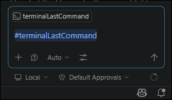

### 4.2 Integration Tests

Integration tests verify API endpoints and database interactions work together.

1. **Run the integration tests**:

   ```bash
   pytest tests/integration/ -v --tb=short
   ```

2. **Expected outcome**: Tests should connect to a test database (usually SQLite in-memory), make API calls, and verify responses. Look for tests that make HTTP requests and check responses.

   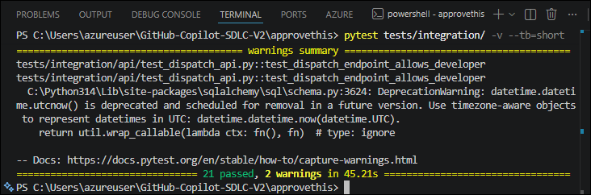

> Integration tests may require the Flask app context to be set up correctly. If you see errors about `application context`, the test fixtures may need adjustment.

### 4.3 E2E Tests (Playwright)

E2E tests are the most complex but also the most valuable for verifying real user workflows.

1. **First, ensure Playwright is installed** (if not already done by Copilot):

   ```bash
   playwright install chromium
   ```

2. **Run the E2E tests in headless mode**:

   ```bash
   pytest tests/e2e/ -v --tb=short
   ```

3. **Expected outcome**: Tests should complete without crashes.

   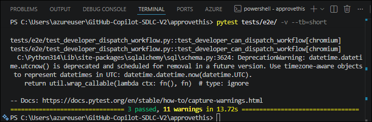

   > E2E tests require the Flask app to be running or the test fixtures to start it automatically. If you see connection errors, verify the test configuration starts a test server.

### 4.4 Troubleshooting Common Issues

If any tests fail, here are quick fixes to try:

| Issue | Quick Fix |
|-------|-----------|
| `ModuleNotFoundError` | Run `pip install -r requirements.txt` and check test dependencies |
| `No tests collected` | Verify test files match `test_*.py` pattern and are in correct directories |
| Database errors | Ensure test fixtures create/reset the test database |
| Playwright errors | Run `playwright install` to install browser binaries |
| Import errors | Check `conftest.py` sets up the Python path correctly |

> Rememeber you can always ask Copilot for help fixing specific errors. Whether they are listed above or not, just provide the error message and context.

### 4.5 Confirm Test Summary

1. Once all three test layers run (even if some tests fail), you've verified the testing infrastructure is in place.

1. **Run all tests together** to get a summary:

   ```bash
   cd approvethis
   pytest tests/ -v --tb=line -q
   ```

1. Take note of:
   - **Total tests collected**: How many tests did Copilot create?
   - **Passed/Failed/Skipped**: What's the current state?
   - **Any critical failures**: Are there blocking issues that prevent tests from running at all?
  
   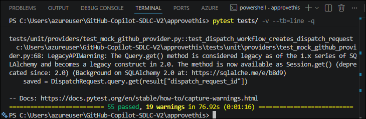

   > If you have time and want to see coverage, run:
   > ```bash
   > pytest tests/ --cov=app --cov-report=term-missing
   > ```

   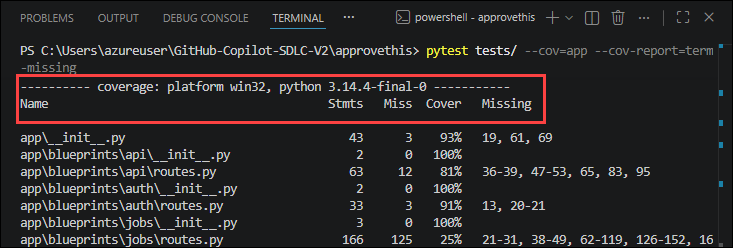

   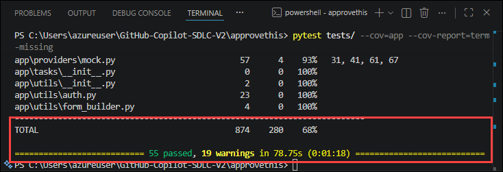

### 4.6 Document Any Issues for Later

1. If you encountered issues during verification, quickly document them in a new file `tests/ISSUES.md` for follow-up. You can ask Copilot to help:

   **Copilot Mode**: `Agent`
   ```
   Create a file `tests/ISSUES.md` that documents any test failures or configuration issues we encountered during verification. Include the error messages and potential fixes.
   ```

   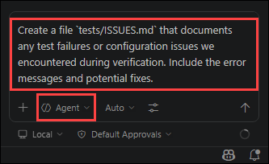

1. This will both help to ensure we don't forget these issues as well as satisfy what Erica asked for earlier.

   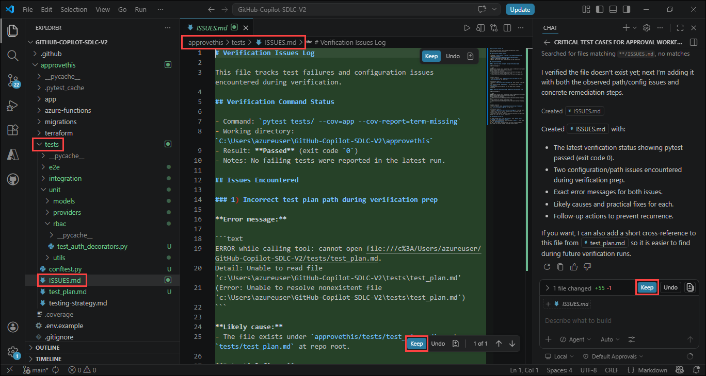

---

## 🏆 Exercise Wrap-Up

Outstanding! You've demonstrated how AI can transform testing from a time-consuming bottleneck into a rapid, parallel workflow. Let's review your accomplishments:

### ✅ What You Accomplished

- [x] Analyzed existing test infrastructure using Copilot
- [x] Created a comprehensive test plan using Copilot's Plan mode
- [x] Leveraged Agent mode to rapidly build entire testing infrastructure
- [x] Ran parallel Copilot sessions to maximize productivity
- [x] Verified unit, integration, and E2E test layers work correctly
- [x] Learned to troubleshoot common testing issues
- [x] Documented issues for later follow-up (as requested by stakeholders)
- [x] Analyzed future testing needs for the approval workflow feature

## 🤔 Reflection Questions

Take a moment to consider:

1. How did using Copilot's Agent mode to build the entire test infrastructure compare to doing it manually?
2. What value did running parallel Copilot sessions provide during the wait time?
3. How does having a documented test plan help when onboarding new team members?
4. What trade-offs exist between speed (Agent mode for everything) vs. control (step-by-step implementation)?
5. How might you balance "good enough for now" testing with technical debt documentation?

## 🎓 Key Takeaways

- **Agent mode accelerates infrastructure setup** - Complex, multi-file tasks can be delegated to Copilot while you focus elsewhere
- **Parallel sessions maximize productivity** - Don't wait idle; use multiple Copilot sessions for analysis and planning
- **Quick verification validates infrastructure** - Running tests confirms setup works, even if some tests fail
- **Documentation prevents knowledge loss** - Capturing issues in `ISSUES.md` ensures problems aren't forgotten
- **pytest-playwright unifies test commands** - All test types run with the same `pytest` command for consistency
- **Plan mode creates shareable artifacts** - Test plans serve as documentation and can guide future development
- **Testing is no longer a bottleneck** — AI assistance makes comprehensive test coverage achievable under time pressure

## 🔜 Coming Up Next

In **Lab 6: IaC and Deployments**, you'll use GitHub Copilot with Azure server to understand and enhance infrastructure as code. You'll explore the existing Terraform modules, make improvements, and deploy infrastructure through both GitHub Actions and the ApproveThis application. Get ready to see how AI transforms infrastructure management!
