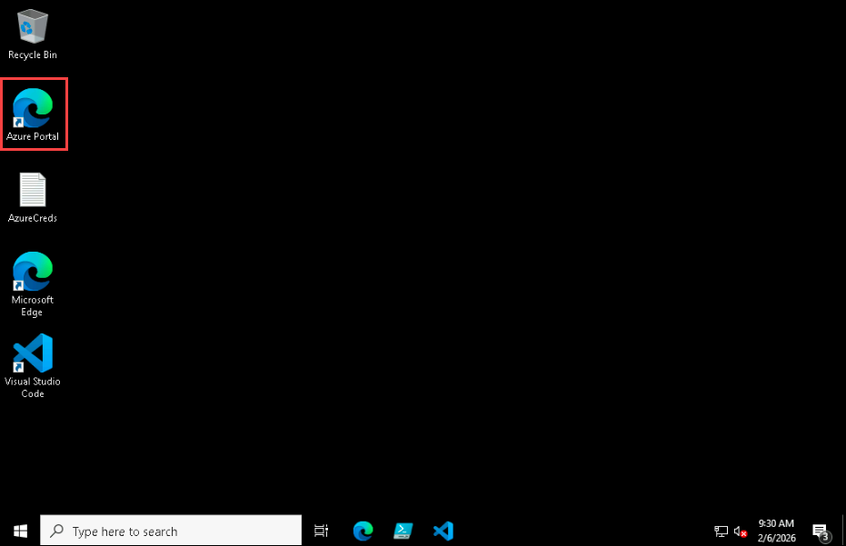
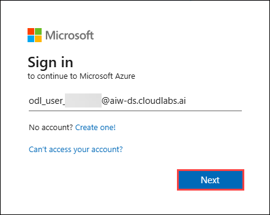
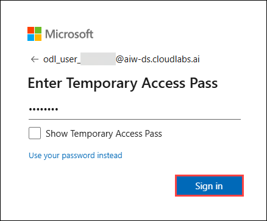
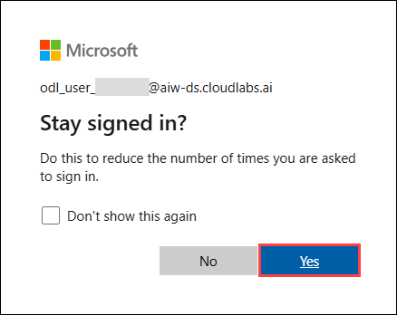

# Exercise 6 - IaC and Deployments with GitHub Copilot

**Duration**: 30 minutes

## 🎯 Learning Objectives

By the end of this lab, you will be able to:
- Use GitHub Copilot to understand existing Terraform infrastructure code
- Navigate and explore Terraform module structures with AI assistance
- Understand the PR-based deployment workflow for infrastructure changes
- Trigger infrastructure deployments through GitHub Actions
- Verify deployment status and understand the deployment pipeline

## 🏢 Infrastructure Deployment at ShipIt Industries

With that high priority issue out of the way it's time to get back to working on ApproveThis.

Your GitHub provider implementation is tested and ready. Erica now wants to discuss deployment:

> **Erica**: "Great progress on the code! Now let's talk deployment. At ShipIt, we try to manage all IaC using **Terraform**. We try to avoid clicking around in cloud consoles - everything is versioned, reviewed, and automated.
>
> I've already set up Terraform modules for ApproveThis. The deployment process is straightforward: when you open a PR, terraform plan runs automatically. When the PR is merged to main, terraform apply runs to deploy to dev.
>
> Let's walk through how it all works so you can deploy your changes!"

---

## Login to Azure portal

1. On your virtual machine, click on the **Azure Portal** icon as shown below:

   

1. On the Sign in to Microsoft Azure tab you will see the login screen, in that enter the following email/username and click **Next**.

   - **Email/Username:** <inject key="AzureAdUserEmail"></inject>

     

1. Now enter the following password and click **Sign in**.

   - **Temporary Access Pass:** <inject key="AzureAdUserPassword"></inject>

     

1. If you see the pop-up **Stay Signed in?**, click **Yes**.

   

1. If a Welcome to Microsoft Azure pop-up window appears, simply click **Maybe later** to skip the tour.

## Step 1: Understanding the Terraform Structure

Let's use Copilot to understand the existing Terraform setup since we're new to this codebase.

> Up to this point the labs have provided example prompts for most exercises to make sure you understand how to interact with Copilot effectively. From here on out, the labs will include fewer example prompts. The goal is to encourage you to think about how to best prompt Copilot for your own needs. 
>
> Not everyone will have the same level of familiarity with the technologies used in this workshop, so the labs will still provide helpful information about what to prompt on and what to look for in the responses, but you will need to take a more active role in crafting your own prompts.
>
> Remember, working with Copilot is an iterative process. If the first response isn't quite what you need, refine your prompt or ask follow-up questions to get closer to your goal.

### 1.1 Explore the Module Structure

1. Let's ask Copilot to explain the overall structure of the Terraform code.

1. The Terraform code for ApproveThis is located in the `approvethis/terraform/` directory. 

1. We want to know:

   - What modules exist?
   - How are they organized?
   - What does each module create?

> Remember that you can always use Copilot to help you locate files even if you aren't familiar with the repo structure or technologies. There's nothing wrong with having Copilot help you undestand the code enough to ask better questions!

<!-- ```
terraform/
├── modules/
│   ├── azure-function/     # Azure Function App module
│   ├── app-service/        # Azure App Service module  
│   └── storage-account/    # Azure Storage Account module
└── environments/
    ├── dev/                # Development environment
    └── production/         # Production environment
``` -->

### 1.2 Understand the App Service Module

1. Ok great! We now have a basic understanding of the module structure. Given that the App Service is where the ApproveThis Flask application will be deployed let's dive deeper into that module.

1. We can have Copilot give us a more in depth explanation of the App Service module.

1. We want to know:

   - What Azure resources does it create?
   - What are the required variables and outputs?

1. **Key resources created:**
   
   - Azure App Service Plan (compute tier)
   - Azure App Service (the web application host)
   - Application settings configuration

### 1.3 Compare Environment Configurations

1. Understanding the differences between dev and production is important for knowing what you're deploying:

1. Let's have Copilot help us compare the two environment configurations.

1. **Typical differences:**

   - App Service Plan tier (Basic for dev, Premium for prod)
   - Number of instances
   - Storage redundancy settings

   > 💡 For detailed Terraform documentation, see [approvethis/terraform/README.md](../approvethis/terraform/README.md) which contains comprehensive information about prerequisites, variables, and deployment options.

### 1.4 Set up Terraform State Management

1. Terraform uses a remote backend for state management. In this setup, the state is stored in an Azure Storage Account. This allows multiple team members to work on the infrastructure code without conflicts.

1. The Terraform configuration is set up to automatically create the necessary storage account and container for state management if they don't already exist.

1. Navigate to the `Actions` tab in your GitHub repository
   
1. Look for the `Terraform Bootstrap` workflow

1. Click `Run workflow` and leave the region as `eastus` (or choose your preferred Azure region), then click `Run workflow` again to start the process

## Step 2: Understanding the Deployment Workflow

ShipIt Industries uses a PR-based deployment workflow. Let's understand how it works.

### 2.1 Review the Terraform Workflows

1. The Terraform process is broken into two main workflows `terraform-plan.yml` and `terraform-apply.yml`.

1. We need to understand how each workflow works so we can use them effectively.

   - When does each workflow trigger?
   - What does each workflow do?
   - How do they report their results?
   - What environment do they target?

1. Once you've gotten a grasp of the workflows it's time to get ready to deploy!

## Step 3: Triggering a Deployment via PR

Now let's walk through the actual deployment process.

### 3.1 Set the Repository Secret

1. Before we can trigger the deployment, we need to make sure the required secrets are set in the repository. These secrets include Azure credentials needed for Terraform to authenticate and deploy resources.

1. Navigate to your repository on GitHub.com

1. Go to `Settings` > `Secrets and variables` > `Actions`

1. Create a new repository secret named `AZURE_CREDENTIALS` with the following JSON value:

   ```json
   {
     "clientId": "your-azure-client/application-id",
     "clientSecret": "your-azure-client-secret",
     "subscriptionId": "your-azure-subscription-id",
     "tenantId": "your-azure-tenant-id"
   }
   ```

### 3.2 Commit and Push Your Changes

If you have any changes that haven't been committed yet and should be included in the deployment, commit and push them now.

> Remember that you can have Copilot help write commit messages for you!
>
> 1. Open the `Source Control panel` (`Ctrl+Shift+G`)
> 2. Click into the **commit message** input box
> 3. Click the **Generate Commit Message** button (similar to ✨) at the end of the input box.

### 3.3 Ready the Pull Request

1. Navigate to your repository on GitHub.com and access your PR
   
1. Click the `Ready for review` button to mark the PR as ready

### 3.4 Watch the Terraform Plan Run

Once your PR is updated, the "Terraform Plan" workflow should trigger automatically:

1. Navigate to the **Actions** tab in your repository
2. You should see a "Terraform Plan" workflow running
3. Wait for it to complete
4. Go back to your PR - you'll see a comment with the plan output!

**What to look for in the plan comment:**
- ✅ Format check status
- ✅ Initialization status
- ✅ Validation status
- 📖 The actual plan showing what will be created/modified

### 3.5 Merge the PR to Deploy

> In a real world scenario, you always want to do human code review. Human code reviews are vital to team collaboration, knowledge sharing, and maintaining code quality. Additionally, Copilot is **BLOCKED** from approving PRs by GitHub as a safety feature.

Once you've reviewed the plan output:

1. Get approval from a reviewer (or approve your own PR if permitted)
2. Click "Merge pull request"
3. Navigate to the **Actions** tab
4. Watch the "Terraform Apply" workflow run automatically

> The apply workflow deploys to the `dev` environment. In a real production scenario, production deployments would require additional approvals and potentially a separate workflow trigger.

## Step 4: Verifying the Deployment

After the apply workflow completes, let's verify what was deployed.

### 4.1 Check the Workflow Summary

1. Navigate to the completed "Terraform Apply" workflow run
2. Click on the job to see detailed logs
3. Look for the "Display Results" step which includes:
   - The Terraform outputs showing all created resources
   - A "Next Steps" section with guidance on deploying the application code
4. The workflow automatically creates all Azure infrastructure (App Service, Storage, etc.)

### 4.2 Deploy and Verify the ApproveThis Application

After infrastructure is provisioned, deploy the application code:

1. Navigate to the **Actions** tab and select the **Deploy App Service Code** workflow
2. Click **Run workflow**, select the `dev` environment, and run it
3. Alternatively, use the **Azure App Service** VS Code extension to deploy directly
4. Once deployed, find the App Service URL in the Terraform outputs or the deploy workflow summary (it will look like `https://app-approvethis-XXXXXXXX.azurewebsites.net`)
5. Open the URL in your browser
6. You should see the ApproveThis login page

> If the application doesn't load immediately, give it a minute — Azure App Service may need to cold-start the application on first request.

### 4.3 Understanding the Deployment Pipeline

Infrastructure provisioning and application code deployment are handled by **separate workflows**:

1. **Terraform Apply** (`terraform-apply.yml`) — Creates/updates Azure resources (App Service, Storage, etc.). Runs automatically on merge to `main` or via manual dispatch.
2. **Deploy App Service Code** (`deploy-app-service.yml`) — Packages the Flask application and deploys it to the provisioned App Service via `az webapp deploy`. Triggered via manual dispatch only.
3. **VS Code Alternative** — You can also deploy the application code using the **Azure App Service** VS Code extension, which is useful for iterative development.

This separation means infrastructure changes are applied automatically on merge, while application code deployment is an explicit, intentional action.

For the purposes of this workshop, the workflows are simplified. In a real production scenario, you would likely have additional safeguards for production deployments such as manual approvals, separate production workflows, and more complex deployment strategies (e.g., blue-green deployments).

### 4.4 Understanding the Job Execution Framework (Preview)

ApproveThis includes a job execution framework that could be used to trigger Terraform operations from the UI. Ask Copilot about it:

<details>
<summary>💡 Example prompt</summary>

```
Explain how JobDefinition, JobExecution, and ExecutionTarget models work together in app/models/. How could this framework be used to trigger Terraform operations from the application UI?
```

</details>

This framework will be important in **Lab 8: Capstone** where you'll implement approval workflows for production deployments!

---

## 🏆 Exercise Wrap-Up

Excellent work! You've learned how infrastructure deployment works at ShipIt Industries. Let's review what you accomplished:

### ✅ What You Accomplished

- [x] Explored and understood existing Terraform module structure using Copilot
- [x] Learned how environment configurations differ (dev vs. production)
- [x] Understood the PR-based deployment workflow (plan on PR, apply on merge)
- [x] Identified required secrets and configuration for deployments
- [x] Triggered a Terraform plan by opening a PR
- [x] Provisioned infrastructure by merging a PR
- [x] Understood the separation between infrastructure provisioning and code deployment
- [x] Previewed the job execution framework for future UI-triggered deployments

## 🤔 Reflection Questions

Take a moment to consider:

1. How does Copilot help you understand infrastructure code you didn't write?
2. What are the benefits of a PR-based deployment workflow over manual deployments?
3. Why is it important to see the Terraform plan before applying changes?
4. How does separating dev and production environments reduce risk?
5. What additional safeguards might you want for production deployments?

## 🎓 Key Takeaways

- **Copilot for IaC understanding** helps you quickly grasp unfamiliar Terraform structures
- **PR-based deployments** ensure all infrastructure changes are reviewed before applying
- **Terraform plan comments** give reviewers visibility into what will change
- **Automatic triggers** (plan on PR, apply on merge) create a predictable deployment flow
- **Separated infrastructure and code deployment** gives independent control over provisioning and application releases
- **Environment separation** (dev/production) prevents accidental production changes
- **Job execution framework** enables future integration of deployments into application workflows

## 🔜 Coming Up Next

In **Lab 7: CI/CD Beyond GitHub Actions**, you'll explore how GitHub Copilot can help with CI/CD across multiple platforms. Not just GitHub Actions, but also Azure DevOps Pipelines, Jenkins, and more. You'll see how Copilot's knowledge extends across the entire DevOps ecosystem!
